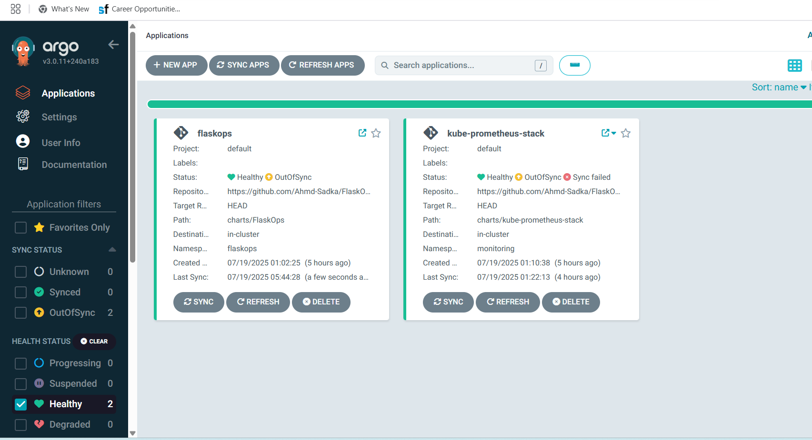

# 🚀 FlaskOps on Kubernetes: Complete Setup Guide
# ==========================================


## Table of Contents
- [1. Infrastructure Setup](#1-infrastructure-setup-) 
- [2. Cluster Status](#2-cluster-status-)
- [3. Network Configuration](#3-network-configuration-)
- [4. Tools & Utilities](#4-tools--utilities-)
- [5. Load Balancer & IAM](#5-load-balancer--iam-)
- [6. CI/CD & Monitoring](#6-cicd--monitoring-)

## 1. Infrastructure Setup 🏗️

### 1.1 CloudShell Security Configuration
```terraform
# Secure SSH access by allowing only CloudShell IP
data "localos_public_ip" "cloudshell_ip" {}

resource "aws_security_group_rule" "cloudshell_ingress" {
    type              = "ingress"
    from_port         = 22
    to_port           = 22
    protocol          = "tcp"
    cidr_blocks       = ["${data.localos_public_ip.cloudshell_ip.ip}/32"]
    security_group_id = "${aws_security_group.default.id}"
}
```

### 1.2 Security Best Practices 🔒
> ⚠️ **Critical Security Notes**:
> - Never generate keys in Terraform (stored in state files)
> - Create and manage key pairs externally
> - Pass sensitive data through variables
> - Use AWS KMS for encrypting sensitive data
> - Implement least privilege principle

### 1.3 Network Architecture 🌐
#### ENI Configuration Strategy
- ✅ Separate ENIs per kubenode
- 🔄 Prevents circular dependencies
- 📍 Pre-determined IP addressing
- 🔗 Improved network isolation

## 2. Cluster Status 📊

### 2.1 Infrastructure Overview


### 2.2 Node Details
| Node Type      | IP Address      | Role          | Status |
|----------------|-----------------|---------------|--------|
| Access Node    | 34.229.142.54  | Control Plane | ✅     |
| Node 01        | 13.219.203.8   | Worker        | ✅     |
| Node 02        | 18.208.198.123 | Worker        | ✅     |

### 2.3 Quick Access Commands
```bash
# Connect to access-node
ssh ubuntu@34.229.142.54

# Check cluster status
kubectl get nodes -o wide
kubectl get pods --all-namespaces
```

## 3. Network Configuration 🌐

### 3.1 Calico CNI Setup
```bash
# Install Calico (Preferred for HA clusters)
kubectl create -f https://raw.githubusercontent.com/projectcalico/calico/v3.26.3/manifests/tigera-operator.yaml
kubectl create -f https://raw.githubusercontent.com/projectcalico/calico/v3.26.3/manifests/custom-resources.yaml
```

#### Why Calico? 🤔
- ✅ Better performance than Weave
- ✅ Advanced network policies
- ✅ Excellent HA cluster support
- ✅ Built-in network security policies

### 3.2 Storage Architecture
#### NFS Configuration
```bash
# Setup NFS Provisioner
helm repo add nfs-subdir-external-provisioner https://kubernetes-sigs.github.io/nfs-subdir-external-provisioner/
helm install nfs-subdir-external-provisioner nfs-subdir-external-provisioner/nfs-subdir-external-provisioner \
    --set nfs.server=<NFS_SERVER_IP> \
    --set nfs.path=/exported/path
```

## 4. Tools & Utilities 🛠️

### 4.1 Essential Tools Setup
```bash
# Helm Installation
curl -fsSL -o get_helm.sh https://raw.githubusercontent.com/helm/helm/main/scripts/get-helm-3
chmod 700 get_helm.sh
./get_helm.sh

# Kubectl Configuration
mkdir -p ~/.kube
scp controlplane01:~/.kube/config ~/.kube/config
chmod 600 ~/.kube/config
```

### 4.2 Node Configuration
```bash
# Set AWS Provider ID for each node
kubectl patch node <worker_node_name> -p '{"spec":{"providerID":"aws:///<Region>/<WORKER_ID>"}}'
```

### 4.3 Monitoring Setup


## 5. Load Balancer & IAM 🔄

### 5.1 AWS Load Balancer Controller
```bash
# Add EKS Helm repo
helm repo add eks https://aws.github.io/eks-charts

# Install AWS Load Balancer Controller
helm install aws-load-balancer-controller eks/aws-load-balancer-controller \
    -n kube-system \
    --set clusterName=kubernetes
```

### 5.2 IAM Authentication Comparison

| Feature                   | EC2 Instance Profile | IRSA (IAM Roles for Service Accounts) |
|--------------------------|---------------------|--------------------------------------|
| 🔒 Security Level        | Basic               | Advanced                            |
| 🎯 Permission Targeting  | Node-wide          | ServiceAccount-specific            |
| 💥 Security Impact       | Large blast radius  | Limited blast radius              |
| 🛠️ Setup Complexity      | Simple             | Moderate                          |
| 📋 Policy Management     | Coarse-grained     | Fine-grained                      |
| 🔄 Pod Mobility          | Node-dependent     | Node-independent                  |

### 5.3 Load Balancer Architecture


## 6. CI/CD & Monitoring 🔄

### 6.1 ArgoCD Setup
```bash
# Get initial admin password
kubectl -n gitops get secret argocd-initial-admin-secret -o jsonpath="{.data.password}" | base64 -d
```

### 6.2 ArgoCD Architecture


### 6.3 Monitoring Stack
- 📊 Prometheus for metrics collection
- 📈 Grafana for visualization
- 🔍 Alert Manager for notifications
- 📉 Node Exporter for hardware metrics

## Quick Reference Links 🔗
- [Calico Documentation](https://docs.projectcalico.org/)
- [AWS Load Balancer Controller](https://kubernetes-sigs.github.io/aws-load-balancer-controller/)
- [ArgoCD Getting Started](https://argo-cd.readthedocs.io/en/stable/)
- [Kubernetes Best Practices](https://kubernetes.io/docs/setup/best-practices/)

---
*Last Updated: July 2025*
