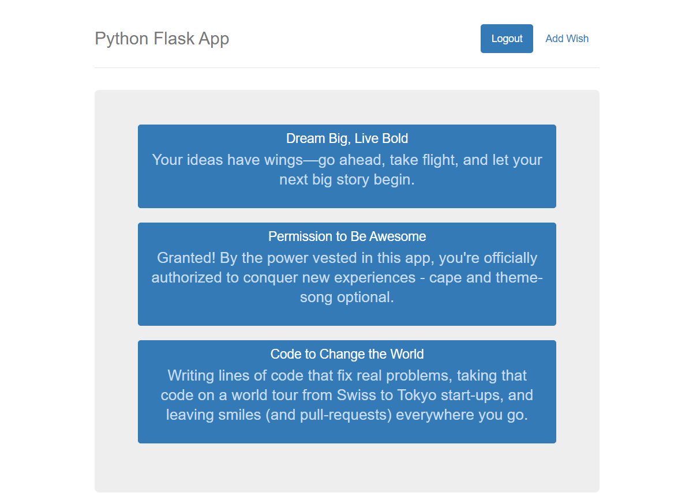
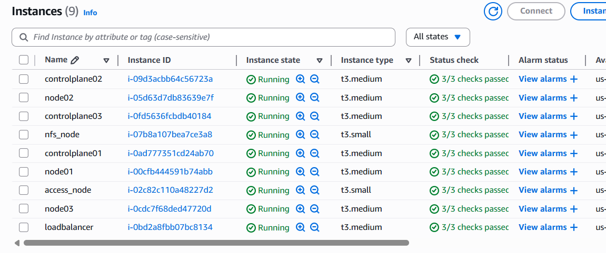
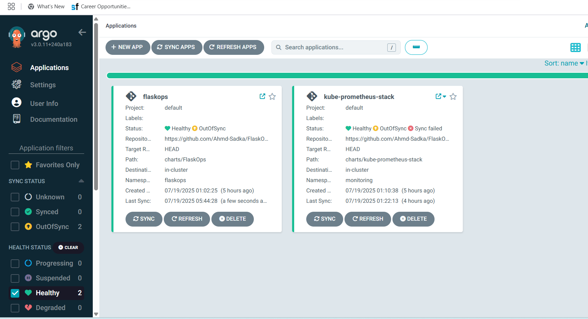
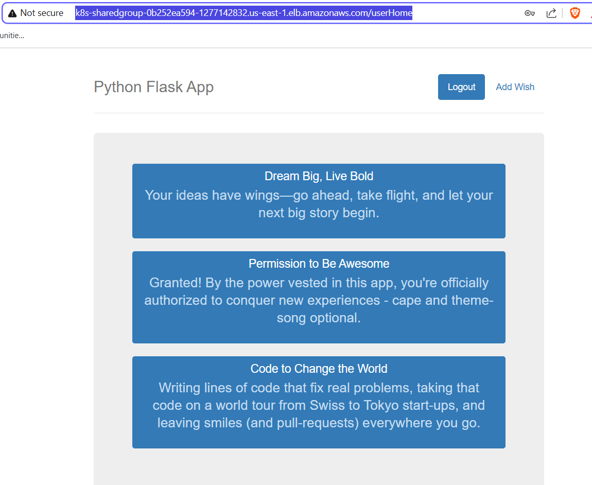
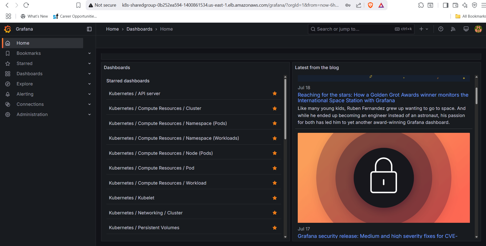

# 🚀 **FlaskOps: The Ultimate DevOps Playground on Kubernetes**  
**_Automate. Observe. Secure. Scale. All-in-One._**

<div align="center">
  
</div>


---

## 🌟 Introduction

**FlaskOps** is a full-stack DevOps showcase project that demonstrates enterprise-grade infrastructure automation, configuration management, GitOps, monitoring, and security - all in one cohesive cloud-native solution.

<div align="center">
  
</div>

> _Provision, configure, deploy, monitor, and secure microservices at scale — all automated, all observable, all yours!_

---

## 🏗️ End-to-End work flow

### 1. Infrastructure Provisioning
Terraform spins up complete AWS infrastructure:
<div align="center">
  
</div>

### 2. GitOps & Configuration
ArgoCD manages deployments while Ansible configures the cluster:
<div align="center">
  
</div>

### 3. Load Balancing & Ingress
AWS ALB Controller handles traffic routing:
<div align="center">
  
</div>

### 4. Monitoring & Observability
Comprehensive dashboards with Grafana:
<div align="center">
  
</div>

---

## ✨ Features

- **Terraform-powered AWS provisioning**
- **Ansible-driven cluster configuration**
- **Helm for Kubernetes deployments**
- **GitOps deployments with ArgoCD**
- **Microservices with Flask & MySQL**
- **Enterprise-grade monitoring (Prometheus, Grafana)**
- **Vault for secrets and credentials**
- **Scalable ingress via AWS ALB**
- **Self-healing, auto-sync, and easy rollbacks**
- **Security best practices baked in**
- **Beautiful dashboards and real-time alerts**

---

## 🛠️ Tech Stack

| Layer         | Tools & Services                      |
|---------------|---------------------------------------|
| Provisioning  | Terraform                             |
| Configuration | Ansible, bash                         |
| Orchestration | Docker, Kubernetes                    |
| Deployments   | Helm, ArgoCD                          |
| App           | Flask (Python), MySQL                 |
| Monitoring    | Prometheus, Grafana, alert manager    |
| Security      | Vault , sg                            |
| Ingress       | AWS ALB Ingress Controller            |

---

## 🚀 Getting Started

### Prerequisites

- AWS CLI & credentials
- Terraform
- Ansible
- kubectl & Helm 3.6+
- ArgoCD CLI (optional)
- Browser for dashboards

---

## 🌍 Infrastructure Provisioning (Terraform)

```sh
cd infrapiolt
terraform init
terraform apply -auto-approve
# Outputs: access-node ssh connect
```
_See [`infrapilot/`](infrapiolt/) for modules and variables._

---

## ⚙️ Cluster Configuration (Ansible)
## Bootstrap configuring access node at first
```sh
cd CAC-Ansible
ansible-playbook star-ship.yml -t bootstrap

```
_See [`ansible/`](CAC-Ansible/) for playbooks and roles._

---
# the bootstrap role on access node will install ansible, helm, kubectl and copy the CAC-Ansible directory to access node

then run the main playbook
```sh
cd CAC-Ansible
ansible-playbook star-ship.yml
```
the roles designed to install the cluster with one click also the ec2s all pre-configured at provisioning with private ips at /etc/hosts and coping the public key to authorized hosts so it supposed to be able to ssh without password and the playbook should work with one click.

# if for any reason the playbook interrupted you may need to hash the kube init and calico tasks in leader init playbook and run the playbook again

## 📦 Application Deployment (ArgoCD + Helm)

### 1. Install ArgoCD and NFS Provisioner with Helm Charts

```chmod 600 controllers.sh
./controllers.sh

```

### 2. Deploy with ArgoCD (GitOps)
# you need to push the repo to your github at first and edit applications with yours.
```sh
kubectl apply -f Gitops-Apps/flaskops.yaml
kubectl apply -f Gitops-Apps/vault.yaml
kubectl apply -f Gitops-Apps/observe.yaml
```
_ArgoCD will auto-sync and manage all releases._

---

## 🧪 Testing Each Service

### FlaskOps Service

- **Browser:**  
  Visit `http://<ALB-DNS>/`
- **Curl:**  
  ```sh
  curl http://<service-name:port>
  curl http://<ALB-DNS>/
  ```
- **Ingress Check:**  
  ```sh
  kubectl get ingress -n flaskops
  ```

### Monitoring
# I edited values to make prometheus, alert manager and grafana run with the same lb dns name at different paths along with the application at the root path.
- **Grafana:**
 
 visit http://<ALB-DNS>/grafana

- **Alertmanager:**

visit http://<ALB-DNS>/alertmanager
    
- **Prometheus:**  

visit http://<ALB-DNS>/prometheus

or you can simply do not use ingress and just port forward the services to your local machine

```sh
kubectl port-forward svc/prometheus 9090:9090 -n monitoring
kubectl port-forward svc/alertmanager 9093:9093 -n monitoring
kubectl port-forward svc/grafana 3000:3000 -n monitoring
```

### Security (Vault)

- **Vault UI:**  

visit http://<ALB-DNS>/vault

---

## 🛡️ Security

- security group (sg) rules allow minimal access required.
- aws roles and policies enforce security best practices.
- Vault manages all secrets and credentials.
- RBAC and network policies enforced via Ansible.
- Sensitive data injected as Kubernetes secrets.

you will need to explixtly add a role to your cluster nodes with aws-load-balancer-controller policy if you will use it as an ingress controller for your cluster. also you may need a oidc provider for IRSA or you can simply create a sercret with your access key and secret key and bind it to aws-load-balancer-controller deployment for just simplicity.

---

## 📊 Monitoring

- Prometheus scrapes metrics from all pods.
- Grafana dashboards visualize app, infra, and cluster health.
- Alertmanager can be configured for notifications.

---

## 🚢 Deployment & Ingress

All deployments are managed via ArgoCD and Helm.  
Ingress is configured for ALB:

```yaml
apiVersion: networking.k8s.io/v1
kind: Ingress
metadata:
  name: flaskops-ingress
  namespace: flaskops
spec:
  ingressClassName: alb
  rules:
    - http:
        paths:
          - path: /
            pathType: Prefix
            backend:
              service:
                name: flaskops
                port:
                  number: 80
```

---

## 🎯 Live Demo Highlights

<table>
  <tr>
    <td><br><em>FlaskOps Web Interface</em></td>
    <td><br><em>GitOps with ArgoCD</em></td>
  </tr>
  <tr>
    <td><br><em>Real-time Monitoring</em></td>
    <td><br><em>Load Balancer Configuration</em></td>
  </tr>
</table>

---

## 🤝 Contributing

We welcome all contributions!  
- Fork the repo
- Create a feature branch
- Submit a PR with clear description and screenshots

See [`charts/vault/CONTRIBUTING.md`](charts/vault/CONTRIBUTING.md) for guidelines.

---

## 📄 License

This project is licensed under the [MIT License](charts/vault/LICENSE).

---

## 💡 Developer Note & Call to Action

> **Ready to master DevOps?**  
> _Provision, configure, deploy, monitor, and secure — all with FlaskOps!_

**Star ⭐ this repo, share your feedback, and join the DevOps revolution!**

---

## 🙏 Acknowledgments

A special thanks to my mentor for the invaluable guidance and support throughout this project. Your expertise and patience helped shape not just this project, but my entire DevOps journey.

## ✍️ Author

<div align="center">
  
  
  **Ahmed Mohamedy**
  
  [](https://github.com/Ahmd-Sadka)
  [](https://www.linkedin.com/in/ahmed-mohamedy-354166239/)
</div>

> _"Infrastructure as Code, Configuration as Code, Everything as Code!"_

---

_Explore the [`FlaskOps-ss`](FlaskOps-ss) folder for more architecture diagrams, dashboards, and live demo links._